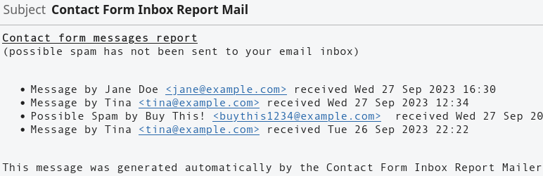

# Contact Form Inbox Report Mailer

Contact Form Inbox Report Mailer sends email reports of Flamingo contact form inbox entries, including possible spam. The Flamingo plugin is required! Contact Form 7 and Aksimet are assumed. An email will be sent to the default admin email adress every day, containing an inbox overview of the last 48 hours in HTML format. Configuration options will be added in upcoming releases. This plugin is free software, provided as-is with absolutely no warranty! Feel free to contribute on GitHub to report problems and add missing features!



## Usage

Install and activate the plugin.

Verify the schedule on the plugin page, (re)activate plugin to (re)schedule, if necessary.

## Development

### Roadmap / TODO

- fix (linters and) WordPress coding style
- release on WordPress.org
- add WP URL to GitHub README, e.g. https://wordpress.org/plugins/contact-form-inbox-report-mailer/
- configuration option for cron time interval
- configuration option for reported time interval
- configuration option to include or omit non-spam messages
- configuration option for alternative email recipient
- configuration option for report mail from address
- configuration option for report mail subject
- configuration option for report style
- localize text
- send multipart/alternative mail body with optional HTML and plain text versions
- make it work with other contact forms or database plugins

### Coding Guidelines

Follow the [detailled WordPress plugin development guidelines](https://developer.wordpress.org/plugins/wordpress-org/detailed-plugin-guidelines/).

In JetBrains IDEA (PhpStorm, WebStorm, etc.) enable WordPress support and set `wp_data` as WordPress path, so that the local code inspections like SonarLint can recognize the built-in functions. You can still mark the directory as excluded to avoid unnecessary indexing and search results.

Some SonarLint warnings (and PHP PSR conventions) should be ignored, like avoiding underscores in function names. As we operate in a global namespace shared with other plugins, it is considered best practice to use a unique prefix for identifiers used for `function`, `class`, and `define`.

A local code sniffer validation can be set up using the provided `composer.json` configuration. Note that this currently does not work with PHP 8, so you need to use a PHP 7.4 runtime (`/usr/bin/php74`). You may need to adjust the IDE settings to WordPress coding standards and code sniffer configurations according to the provided tutorial.

- https://packagist.org/packages/wp-coding-standards/wpcs
- https://www.jetbrains.com/help/idea/using-php-code-sniffer.html#installing-configuring-code-sniffer
- https://www.linuxbabe.com/ubuntu/php-multiple-versions-ubuntu

### SVN Release Tags

We use `git` branches and tags for feature development, and `svn` to release to the WordPress plugin directory. So all development is done in `contact-form-inbox-report-mailer/trunk`!

To add svn tags, use the `svn` command or create a new symbolic link in the `tags` directory. [Symbolic links are stored as files in git.](https://stackoverflow.com/questions/954560/how-does-git-handle-symbolic-links) So we should not add `tags` to `.gitignore`, but we can mark it as an ignored / excluced directory in our IDE to make sure we only edit and search files our `trunk` directory.

```
cd incompatibility-status/tags
ln -s ../trunk 1.0.0
```

Replace `1.0.0` with the new release tag name.

### Verify the Plugin before committing

To verify the release, create an archive file of the tag directory, e.g.

```
cd incompatibility-status/tags
zip incompatibility-status-1.0.0.zip 1.0.0
```

The resulting zip archive file can be uploaded into an existing WordPress instance to verify that it works.

Commit the result to both repositories:

```
git commit -a
git push
git tag "1.0.0"
git push --tags
cd incompatibility-status
svn commit
```

#### Validate the readme file

Run `incompatibility-status/trunk/readme.txt` through the official [WordPress ReadMe Validator](https://wordpress.org/plugins/developers/readme-validator/). You’ll get notified if there is an error in your file.

### Tag Versions in Git vs. SVN

Development milestones that do not correspond to official releases, should be tagged as subversions (e.g `1.1.1` -> `1.1.2`) only in git, so that we only release major and minor versions in the official WordPress directory svn repository. We could also use suffixes in git, like during a review process, where we have to submit subsequent refined versions of the same target release tag, e.g. `1.0.0-rc3` for the third release candidate of the official `1.0.0` release.

### Local development enviroment

```
composer install
npm install
docker-compose up
```

open http://localhost:8000/

Install or update the Flamingo plugin.

Technically, Contact Form 7 and Akismet are optional. All we need are the custom post types and fields created by Flamingo and some test data. You can export flamingo inbox entries from an existing production installation and import it into the local installation using WordPress importer (not pre-installed by default) or via a partial sqldump (for experienced developers).

Ensure file ownership and permissions, if necessary, e.g.

```
chown -R www-data:www-data ./wp_data
```

### Build a zip distribution without SVN

`npm run build:zip` creates a plugin archive file in the `dist` folder that can be uploaded as a WordPress plugin.
